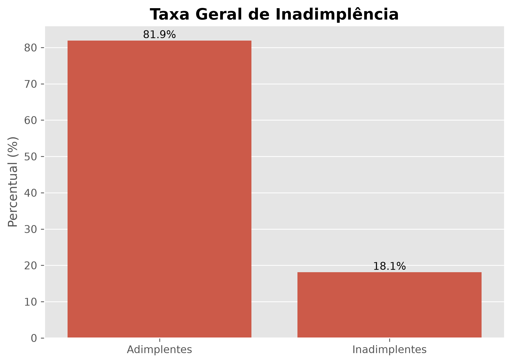
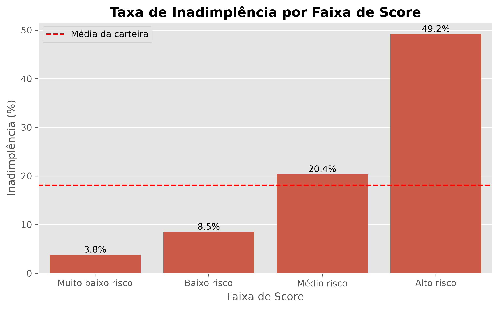
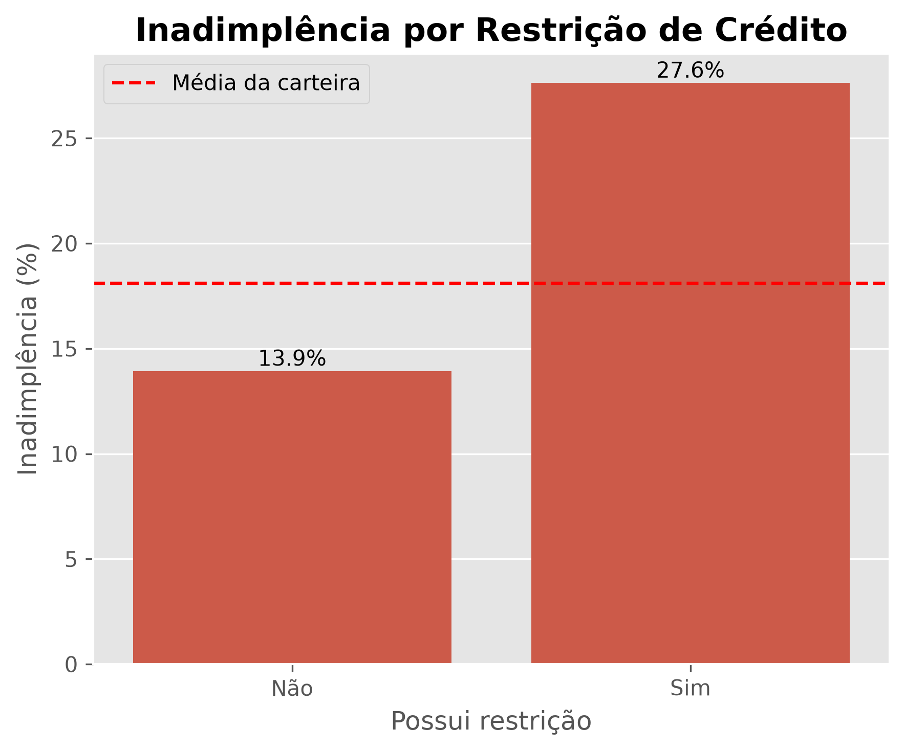
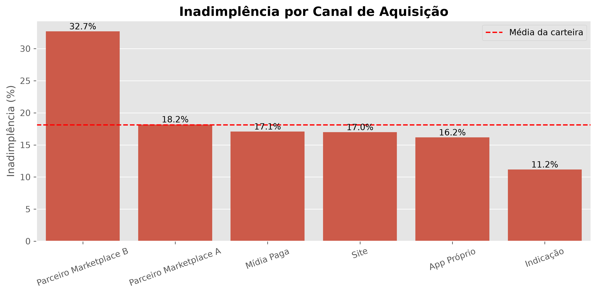

# 📊 Análise de Inadimplência em Operações de Crédito

## 📖 Sobre o Projeto

Este projeto apresenta uma **Análise Exploratória de Dados (EDA)** aplicada a uma base fictícia de uma fintech, com o objetivo de identificar padrões relacionados à inadimplência e gerar insights que apoiem decisões de concessão de crédito.

Durante o desenvolvimento foram utilizadas técnicas de limpeza, tratamento de dados, engenharia de atributos e visualização de informações para compreender o perfil dos clientes e os fatores associados ao risco de crédito.

> **Observação:** Os dados utilizados são fictícios e o projeto foi desenvolvido exclusivamente para fins de estudo e demonstração de habilidades em Análise de Dados.

---

# 🎯 Objetivos

- Analisar o perfil dos clientes inadimplentes.
- Identificar fatores relacionados ao risco de crédito.
- Criar categorias para facilitar a interpretação dos dados.
- Gerar visualizações para apoiar a tomada de decisão.
- Propor melhorias para a estratégia de concessão de crédito.

---

# 🛠 Tecnologias Utilizadas

- Python
- Pandas
- NumPy
- Matplotlib
- Seaborn

---

# 📂 Estrutura do Projeto

```text
CASE_ENOVA/
│
├── Data/
│   ├── case_inadimplencia_dataset.csv
│   └── dicionario_de_dados.md
│
├── Output/
│   └── Output/
│       └── Graficos/
│           ├── grafico_taxa_geral.png
│           ├── grafico_score.png
│           ├── grafico_restricao.png
│           └── grafico_canal.png
│
├── main.py
└── README.md
```

---

# 🔍 Etapas da Análise

O projeto foi desenvolvido seguindo as seguintes etapas:

- Importação da base de dados.
- Verificação de valores nulos.
- Identificação de registros duplicados.
- Conversão das datas.
- Análise estatística descritiva.
- Engenharia de atributos.
- Criação de faixas de idade.
- Classificação do score de crédito.
- Classificação do comprometimento de renda.
- Análise exploratória dos fatores associados à inadimplência.
- Construção de gráficos para apresentação dos resultados.

---

# 📌 Principais Insights

Durante a análise foram identificados diversos padrões relevantes:

- A carteira apresentou uma **taxa geral de inadimplência** próxima de **18%**, servindo como referência para comparação entre os segmentos.

- Clientes classificados como **Alto Risco** pelo score interno apresentaram uma taxa de inadimplência significativamente superior à média da carteira.

- Clientes com **restrição de crédito** possuem maior probabilidade de inadimplência quando comparados aos clientes sem restrições.

- O canal de aquisição influencia diretamente o comportamento da carteira, indicando que determinados canais concentram maior número de clientes inadimplentes.

- A criação de faixas de idade, score e comprometimento de renda permitiu segmentar melhor os clientes e identificar grupos com maior exposição ao risco.

- A engenharia de atributos tornou a análise mais interpretável e facilitou a construção dos indicadores.

---

# 📊 Resultados

A análise permitiu:

- Identificar segmentos de maior risco.
- Medir a inadimplência por faixa de score.
- Avaliar o impacto da restrição de crédito.
- Comparar o desempenho entre diferentes canais de aquisição.
- Criar indicadores que auxiliam decisões de concessão de crédito.

---

# 📈 Visualizações

## Taxa Geral de Inadimplência



Apresenta a distribuição entre clientes adimplentes e inadimplentes da carteira.

---

## Inadimplência por Faixa de Score



Mostra como a taxa de inadimplência varia conforme a classificação do score interno.

---

## Inadimplência por Restrição de Crédito



Evidencia o impacto do histórico de restrições na probabilidade de inadimplência.

---

## Inadimplência por Canal de Aquisição



Permite comparar o desempenho da carteira conforme o canal utilizado para aquisição dos clientes.

---

# 💡 Propostas de Melhoria

Com base nos resultados obtidos, algumas ações podem contribuir para reduzir o risco da carteira:

### ✔ Aprimorar o modelo de concessão de crédito

Utilizar score interno, histórico de restrições e comprometimento de renda como variáveis prioritárias na avaliação dos clientes.

### ✔ Monitoramento Contínuo

Desenvolver dashboards para acompanhar a inadimplência em tempo real por segmento de clientes.

### ✔ Estratégias por Canal

Reavaliar políticas comerciais para canais com maior concentração de inadimplentes.

### ✔ Modelagem Preditiva

Como evolução do projeto, desenvolver modelos de Machine Learning para prever o risco de inadimplência antes da concessão do crédito.

---

# 🚀 Como Executar

Clone o repositório:

```bash
git clone https://github.com/SEU-USUARIO/credit-default-analysis.git
```

Instale as dependências:

```bash
pip install pandas numpy matplotlib seaborn
```

Execute:

```bash
python main.py
```

---

# 💼 Competências Demonstradas

- Análise Exploratória de Dados (EDA)
- Limpeza e tratamento de dados
- Engenharia de Atributos
- Estatística Descritiva
- Segmentação de Clientes
- Visualização de Dados
- Análise de Risco de Crédito
- Storytelling com Dados

---

## 👨‍💻 Autor

**Gabriel Molinari**

Estudante de Sistemas de Informação com foco em Análise de Dados.

- LinkedIn: https://www.linkedin.com/in/gabriel-molinari-b85095352/

